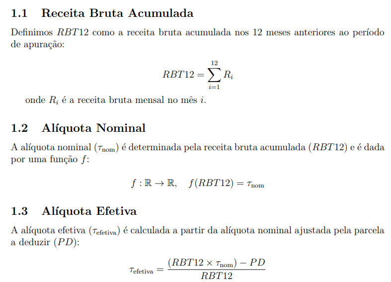
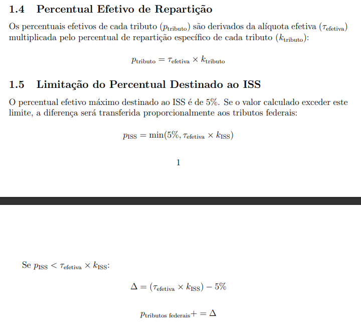
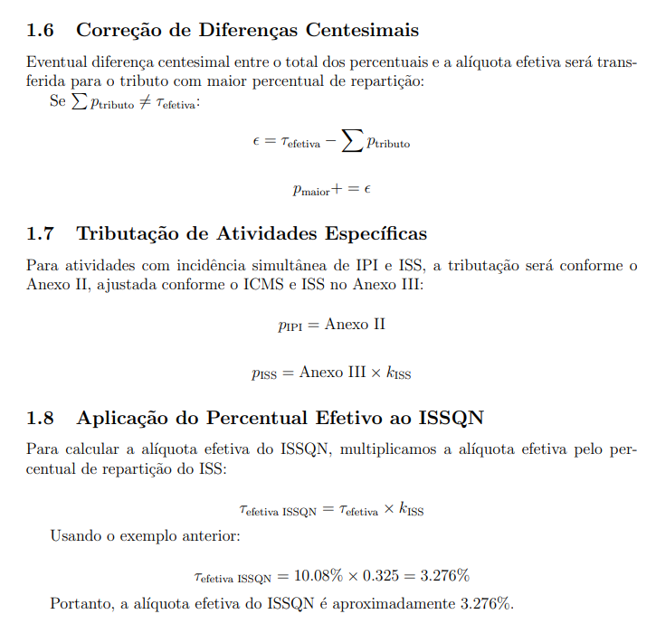

# Calculadora de Alíquota do Simples Nacional

## Descrição

Este projeto oferece uma calculadora para determinar a alíquota efetiva do ISS no regime do Simples Nacional, voltada para microempresas e empresas de pequeno porte. Ele inclui implementações em Python e VBA para Excel.

## Estrutura do Repositório

- `teoria/`: Contém documentos detalhando as fórmulas matemática e a legislação.
- `codigo_python/`: Contém o script Python para a calculadora.
- `codigo_vba/`: Contém o script VBA para a calculadora no Excel.
- `exemplos/`: Contém exemplos de uso dos scripts.
- `documentacao/`: Contém documentação detalhada sobre o código e a teoria.

## Como Usar

### Python

1. Certifique-se de ter o Python instalado.
2. Navegue até o diretório `codigo_python`.
3. Execute o script com o comando: `python calculadora.py`.

### VBA

1. Abra o Excel.
2. Importe o script VBA no Editor do VBA.
3. Siga as instruções no arquivo de exemplo para usar a calculadora.

## Matemática

Para detalhes sobre a matemática por trás da calculadora, consulte a pasta `teoria/`.

## Contribuição

Sinta-se à vontade para contribuir com melhorias ou correções. Abra uma issue ou envie um pull request.

## Licença

Este projeto é licenciado sob a [MIT License](LICENSE).

